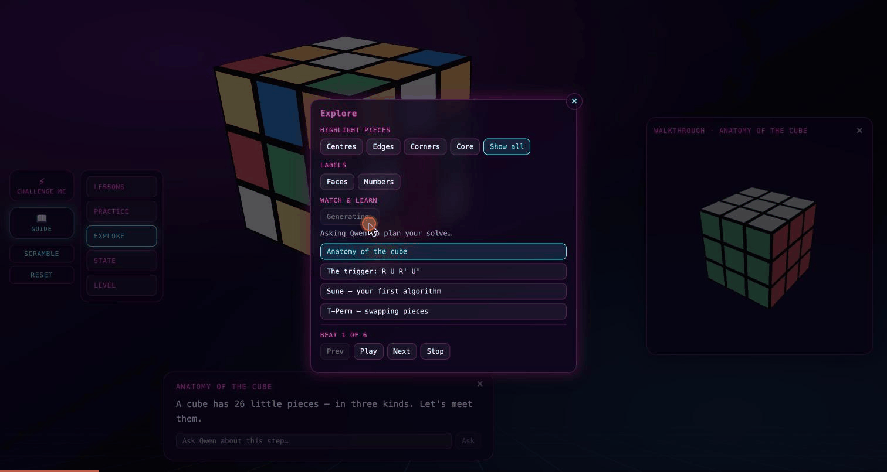
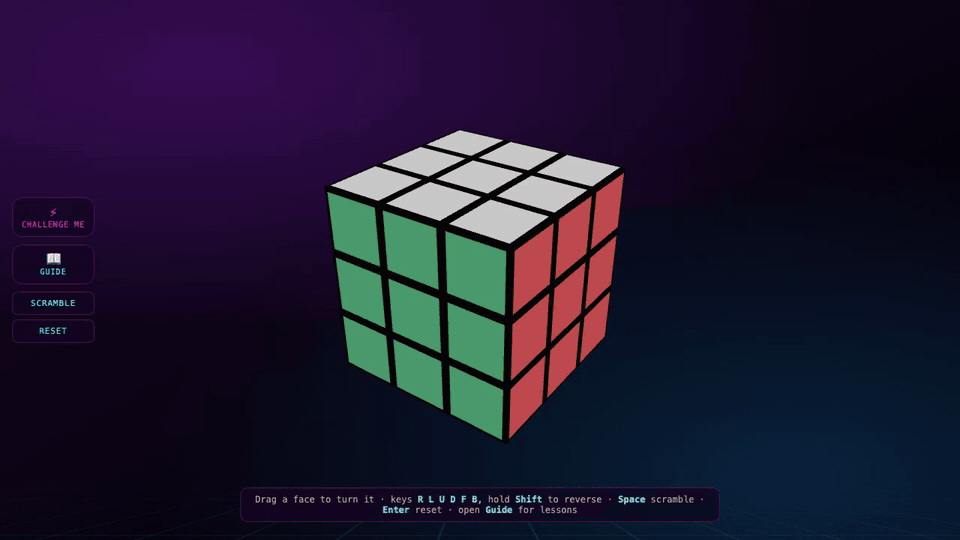
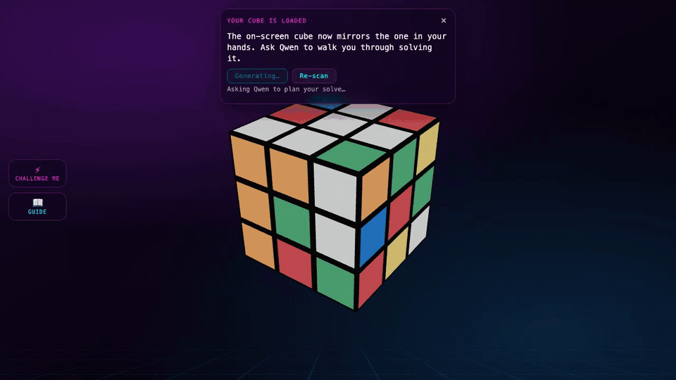

# Qwen Rubik Instructor

An interactive, browser-based Rubik's Cube tutor. You turn a real 3D cube —
drag, keyboard, or touch — and **Qwen** teaches on top of it: generated
lessons from your live cube state, narrated solve walkthroughs, grounded
mid-lesson Q&A, and a memory that remembers how you're doing across sessions.
And it's not just the on-screen cube: **point your camera at your own
scrambled cube** and the app scans it in, six sides in under a minute, then
walks you through solving the real thing in your hands — checking your actual
cube at every stage.

**Live at [rubik.suryatresna.asia](https://rubik.suryatresna.asia)** · built for
the Qwen Cloud Hackathon (MemoryAgent track).



## Features

- **A real cube** — drag a face or use full notation (`U D L R F B`, slices
  `M E S`, rotations `x y z`, `Shift` for prime). Works entirely offline.
- **Bring your own cube** — scan your physical cube with the webcam or phone
  camera (guided, six sides, auto-capture when you hold still) and it loads
  into the app. The sticker colors are read **on-device** — median sampling +
  LAB color matching calibrated against your cube's own centers, free and
  instant — with group-theory validation that catches impossible scans and
  points at the exact stickers to fix; **Qwen-VL** is the tie-breaker for
  genuinely ambiguous stickers (red vs orange in dim light). Then the solve
  runs on the *real* cube: follow it in 3–6 move chunks, and at each stage
  show the camera any two sides — the app verifies your physical cube, and if
  something's off it names the exact moves to undo.
- **Qwen-generated teaching** — "Lesson from my cube" and "Solve my cube"
  stream narrated, animated plans for your exact cube state over SSE. A
  layer-by-layer solver builds the plan; Qwen only writes the words
  (*deterministic skeleton, generative skin* — narration can never invent a
  move the plan doesn't contain).
- **Hints, checkpoints, Ask Qwen** — every lesson step ships hints, keeps a
  cube-state checkpoint you can return to, and takes free-form questions
  answered against your live cube. A "Show me how" reference cube demonstrates
  moves without touching yours.
- **Learner memory with forgetting** — mastery, struggles, and review timing
  tracked in the browser, decayed over time, and injected into every prompt
  under a strict budget. Optionally mirrored to Turso/libSQL so Qwen remembers
  you across devices.
- **Practice drills & leaderboards** — graded against the cube (not your move
  transcript), with timed solves ranked per drill.
- **Challenge Me** — a full-cube race with Google sign-in, a server-side
  clock (the client never reports its own time), anti-cheat handling, and a
  public leaderboard on the landing page.
- **Session review canvas** — every narrated solve is captured as it streams
  and replayed at `/review` as a scroll-scrubbed tour: the scramble, each
  solver checkpoint with Qwen's original narration and full move notation,
  through to solved — designed to be followed on a **real physical cube**.
  Plays hands-free (play/pause/replay), works on the phone, and mirrors to
  Turso so the review follows you across devices.






## Quick start

Requires **Node.js 20.19+** (or 22.12+/24+) and **Python 3.10+**.

```bash
# Frontend — http://localhost:5173
echo 'PUBLIC_BACKEND_URL=http://localhost:8000' > frontend/.env
npm install
npm run dev

# Backend — powers the Qwen features
cd backend
python3 -m venv .venv && .venv/bin/pip install -r requirements.txt
DASHSCOPE_API_KEY=sk-... .venv/bin/uvicorn main:app --port 8000
```

The cube and hand-authored lessons work without the backend; Qwen generation
needs it (a DashScope key — Alibaba Cloud, OpenAI-compatible). Everything else
is optional and degrades gracefully:

| Env var (backend `.env`) | Enables |
| --- | --- |
| `DASHSCOPE_API_KEY` | Qwen narration & Q&A (falls back to deterministic text without it) |
| `TURSO_DATABASE_URL` (+ `TURSO_AUTH_TOKEN` for cloud) | cross-session learner memory & leaderboards |
| `GOOGLE_CLIENT_ID` / `GOOGLE_CLIENT_SECRET` | Challenge Me sign-in |

## Controls

| Action | Input |
| --- | --- |
| Rotate a layer | Drag a face |
| Face turns / slices / rotations | `U D L R F B` / `M E S` / `x y z` |
| Counter-clockwise (prime) | `Shift` + key |
| Scramble / Reset | `Space` / `Enter` |
| Scan your physical cube | **Guide → Camera** (or enter colors by hand) |

## Architecture

SvelteKit + Threlte frontend, FastAPI backend, DashScope (Qwen for narration,
Qwen-VL for scan assists), Google OAuth, Turso/libSQL. All camera vision runs
client-side (no video ever leaves the browser; the Qwen-VL fallback sends
single face crops, server-side key, rate-limited). Deployed as three
containers (Caddy TLS → nginx frontend + uvicorn backend) on an Alibaba Cloud
Simple Application Server via `docker-compose.yml`.

Diagrams for the whole system — services, narration pipeline, memory system,
challenge/auth, deployment, data model — live in
[`docs/diagrams/`](./docs/diagrams/) and are walked through with screenshots
in [the architecture & feature tour](./docs/16-architecture-and-feature-tour.md).

## Tests

Backend 817 tests · frontend 375 unit tests · 34 Playwright E2E tests
(desktop + mobile), running the real stack with the LLM pinned to its
deterministic fallback — no API bill. The scanner is tested without a camera
(pure functions over a labeled image corpus, with accuracy gates in CI) and
end-to-end through a fake `getUserMedia` camera; the cube-legality validator
is cross-validated TypeScript↔Python against a shared frozen fixture.

```bash
npm run test                                # frontend unit (Vitest)
cd frontend && npx playwright test          # E2E (desktop + mobile)
cd backend && .venv/bin/pytest              # backend
```

## Demo footage

`frontend/e2e/record-footage.spec.ts` (10 desktop clips, 1920×1080) and
`record-footage-mobile.spec.ts` (4 iPhone 13 clips, 390×664 portrait) drive
every flow — landing, lessons, drills, Qwen solve, camera scan, guided
physical solve, authenticated challenge, review replay — at learner pace
while Playwright records video. They are gated behind `RECORD_FOOTAGE=1` so
the normal E2E suite never runs them, and they expect pre-started servers so
the narration is real Qwen (not the test-suite fallback). Point the backend
at a throwaway DB and seed a member + token for the challenge clip (see
`auth/session.py::create_token`); recordings land in `test-results/` as
`.webm` — convert with ffmpeg (`-c:v libx264 -crf 18 -movflags +faststart`)
into an untracked `footage/` folder.

```bash
# Terminal 1 — backend with real key, isolated DB
cd backend && TURSO_DATABASE_URL=data/footage.db .venv/bin/uvicorn main:app --port 8000
# Terminal 2 — frontend
cd frontend && PUBLIC_BACKEND_URL=http://127.0.0.1:8000 npm run dev -- --port 5173 --strictPort
# Terminal 3 — record
cd frontend
RECORD_FOOTAGE=1 FOOTAGE_AUTH_TOKEN=<seeded> npx playwright test e2e/record-footage.spec.ts --project=desktop --workers=1
RECORD_FOOTAGE=1 npx playwright test e2e/record-footage-mobile.spec.ts --project=mobile --workers=1
```

## Engineering notes

How this was built — the memory design, the curriculum, the grading fixes,
the SvelteKit rewrite, the E2E strategy, auth, the deployment, the review
canvas, and the physical-cube camera scanning — is an 18-part blog series in
[`docs/`](./docs/README.md).

## License

See [LICENSE](LICENSE).
