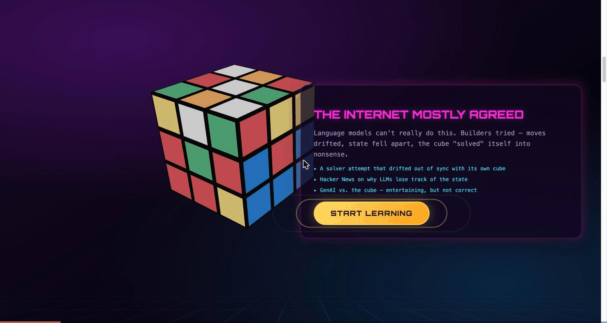
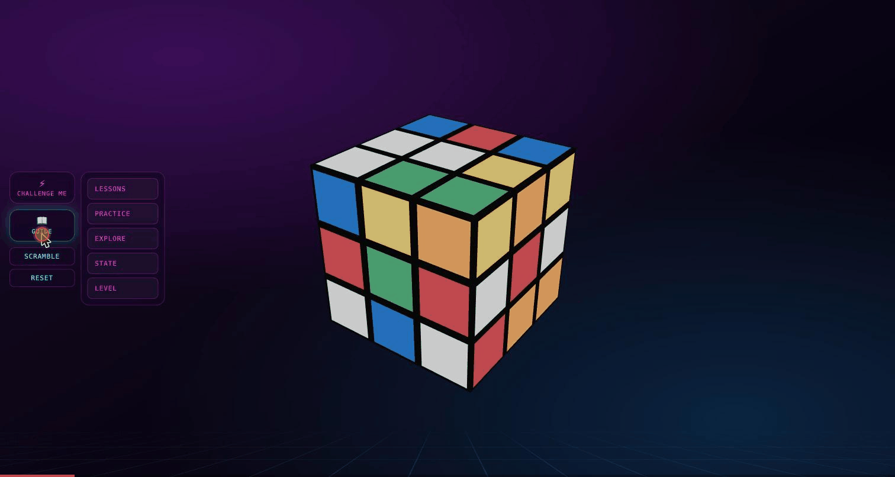
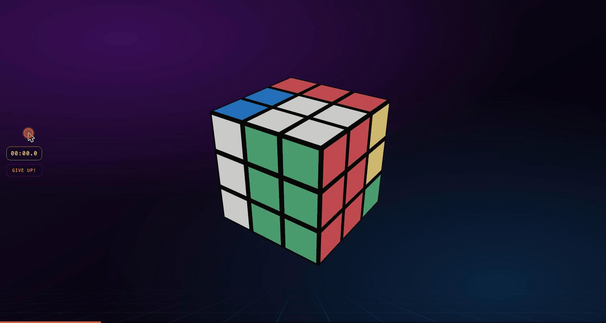

# Qwen Rubik Instructor — Submission

An interactive 3D Rubik's Cube tutor where **Qwen teaches on a cube it can
actually see** — generated lessons from your live cube state, narrated solves,
grounded hints, and a memory that remembers (and forgets) how you're doing.

**Live at [rubik.suryatresna.asia](https://rubik.suryatresna.asia)** · Qwen
Cloud Hackathon, MemoryAgent track · engineering log in [`docs/`](./docs/README.md)

## Inspiration

"They said an LLM couldn't solve a Rubik's Cube." The internet mostly agreed —
every attempt we found drifted out of sync with its own cube: moves
hallucinated, state fell apart, the cube "solved" itself into nonsense. At the
same time, actually learning the cube as a human is famously miserable:
static tutorials, algorithm walls, and no one watching *your* cube when you
get stuck.

Those are the same problem. A tutor is only trustworthy if it's grounded in
the real state of the thing you're holding — and a tutor is only *good* if it
remembers you: what you've mastered, where you struggle, what you've had time
to forget. The MemoryAgent track gave us the framing; the cube gave us a
domain where every claim the model makes is mechanically checkable.

## What it does

You play with a real 3D cube — drag a face, use full move notation on the
keyboard, or a touch keypad on the phone. Everything else is a teaching layer
on top of that cube:

- **"Solve my cube (Qwen)"** — a deterministic layer-by-layer solver plans a
  solve for your exact scramble, and Qwen narrates it step by step over a live
  stream while a reference cube demonstrates. One click applies it to your
  cube — and it genuinely ends solved.

- **"Lesson from my cube (Qwen)"** — generates a lesson tailored to your
  current cube state, with steps, example moves, hints, and checkpoints you
  can always return to.

- **Hints and grounded Q&A** — every step carries hints, and an "Ask Qwen"
  box answers free-form questions *against your live cube*, so the answer is
  about your stickers, not a generic cube.

- **A memory that forgets** — mastery, struggles, and review timing are
  tracked as you practice, decayed over time (old mistakes fade, mastered
  skills come due for review), compressed into a small digest, and injected
  into every prompt. Come back days later and Qwen opens with "Welcome back —"
  and picks up where *you* actually are. With the optional database mirror,
  that memory follows you across devices.

- **Lessons, drills, and walkthroughs** — a full hand-authored
  layer-by-layer curriculum whose every algorithm is machine-verified, plus
  repeatable drills graded against the cube itself (not your move transcript).

- **Challenge Me** — a full-cube race with Google sign-in, a server-side
  clock the client can't lie to, anti-cheat handling, confetti, and a public
  leaderboard on the landing page.

## How we built it

One rule shaped the whole system: **deterministic skeleton, generative skin.**
The cube math, the solver, the curriculum algorithms, and the grading are all
deterministic and tested. The LLM only ever writes *words* over a structure it
cannot break — a validator rejects any narration that mentions a move the plan
doesn't contain, and swaps in a deterministic fallback instead. That boundary
is what makes an LLM tutor trustworthy instead of plausibly wrong.

The frontend is SvelteKit with a Three.js cube; it works fully offline. The
FastAPI backend adds the generative layer: a facelet engine (a bit-for-bit
port of the frontend's cube model, cross-validated between the two languages),
a layer-by-layer solver that replays every solution and asserts it solved, a
planner that turns cube states into narratable plans, and Qwen — `qwen-plus`
via DashScope — narrating frames concurrently so the first beat lands in about
a second while the rest stream in.

The memory system is deliberately client-authoritative: the browser owns the
learner profile, applies the decay/forgetting model, and syncs snapshots to a
Turso/libSQL mirror guarded by a single-env-var kill switch. The digest logic
exists on both sides of the mirror, so a returning learner on a new device
still gets remembered.

Challenge mode terminates Google's sign-in flow in the backend and — the part
that keeps the leaderboard honest — keeps the clock on the server: a run
starts by minting a single-use session key with a server timestamp, and the
score is computed server-side when the key is redeemed. The client never
reports its own time.

Everything ships as three containers (Caddy with automatic HTTPS, an nginx
frontend, a uvicorn backend) on an Alibaba Cloud Simple Application Server,
with a tag-to-deploy pipeline.

And it's tested like we mean it: 739 backend tests, 238 frontend unit tests,
and 25 end-to-end browser specs that play the whole game — scramble, stream a
narrated solve, assert the cube ends solved — with the LLM pinned to its
deterministic fallback so the suite costs nothing to run. The full set of
diagrams (narration pipeline, hint flows, challenge/auth sequence, data model)
lives in [`docs/diagrams/`](./docs/diagrams/), and the sixteen-part build log
in [`docs/`](./docs/README.md).

## Challenges we ran into

- **A correct solve nobody could follow.** The first solver output was
  provably correct and completely unusable — 246 moves with 32 whole-cube
  rotations for a 13-move scramble. We eliminated the rotations by
  conjugation and verified the result against the engine; making correct
  *followable* turned out to be half the product.
- **The narration that felt slow.** "Qwen takes too long" had no instrument
  behind it. Adding per-call latency and token logging revealed two unrelated
  causes: a deep-reasoning model as the default (~33s per frame), and a
  streaming pipeline that quietly waited for *everything* before sending
  *anything*. A model default and a one-word concurrency fix later, the first
  narrated beat lands in about a second.
- **The tutor that lied.** A cynical QA pass caught the grader scoring the
  learner's move *transcript* instead of their cube — a wrong move followed by
  "apply the example" counted as correct. Grading was rebuilt to check cube
  state against each stage's target.
- **Memory that was just a log.** Held against the MemoryAgent rubric, our
  first "memory" was an append-only history. Real memory needed a decay
  curve, timely forgetting, relevance-ranked recall, and a strict injection
  budget — the model gets a few hundred characters of *what matters now*, not
  a transcript.
- **The cheat that almost shipped.** The cube doesn't know that Reset
  restores the solved state — so during a timed challenge run, Reset was an
  instant win. Anything the challenge didn't initiate now cancels the run,
  and the HUD strips down to a timer and a "Give Up!" button.
- **Testing an LLM app without an API bill.** The E2E suite runs the *real*
  stack — real solver, real streaming — with the model calls pointed at an
  unroutable address so the deterministic fallback narrates. The browser found
  bugs no unit test could: a server error wearing a CORS mask, a typewriter
  frozen by its own cleanup, a backdrop eating clicks.

## Accomplishments that we're proud of

- **An LLM that "solves" a Rubik's Cube honestly** — by never letting it
  touch the cube math. Scramble anything, click once, watch it narrate its
  way to a genuinely solved cube.
- **A memory with a forgetting curve**, not a chat log — decayed struggles,
  review-due skills, budgeted recall, and a visible "welcome back" that
  reflects what you actually did last time.
- **A leaderboard you can believe**, because the clock lives on the server
  and a solve can't be faked with a Reset.
- **A thousand tests around one boundary** — 739 + 238 + 25 across two
  languages, including a cross-validated cube engine ported bit-for-bit.
- **It's live** — three containers on Alibaba Cloud behind automatic HTTPS at
  [rubik.suryatresna.asia](https://rubik.suryatresna.asia), with the whole
  journey written up as a sixteen-part engineering log.

## What we learned

- **Verify before you build.** Our first confident diagnosis of "the backend
  is broken" was simply wrong; reproducing in the real UI beat code surveys
  every time the two disagreed.
- **Measure before you fix.** Both "slow narration" causes were invisible
  until we logged latency — and neither was the thing we'd guessed.
- **LLMs should narrate state, not own it.** Every failure mode we saw in
  prior art came from letting the model carry the cube; every guarantee we
  shipped came from refusing to.
- **Memory is a product feature, not a database.** Storing everything is
  easy; deciding what to *forget*, and how little to inject, is what makes the
  model feel like it knows you.
- **A green suite isn't the finish line.** After the E2E suite passed, a
  human pass and phone emulation each found bugs the green suite couldn't —
  the browser, and then the human, remain the last two test layers.

## What's next for Rubik Instructor

- **More courses.** The layer-by-layer beginner track is complete and
  verified; next come the speedcubing tracks — F2L, OLL, PLL — authored the
  same way: every algorithm machine-checked, every lesson narrated from the
  learner's own cube.
- **Let the players in.** It's deployed and public, and we expect people to
  just play it. Playtesting is ongoing — some sessions went well, some
  players were genuinely impressed, and one honest finding: the Rubik's Cube
  learning curve is steep on its own, so it isn't everyone's cup of tea. But
  even the players who bounce off learning get their moment — with "Solve my
  cube" they can gimmick their way to a solved cube and feel the payoff the
  puzzle usually gatekeeps.
- **Meet the learners where they drop off.** The playtest lesson is that the
  hard part isn't our UI, it's the puzzle — so the next design work is
  gentler on-ramps: shorter wins early, more "show me" and less notation, and
  the memory system steering learners back to exactly the step that lost them.
- **The 3-minute demo** — the cross-session memory loop end to end, the one
  story that ties the whole thing together.
