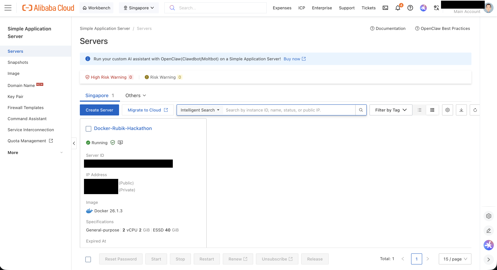
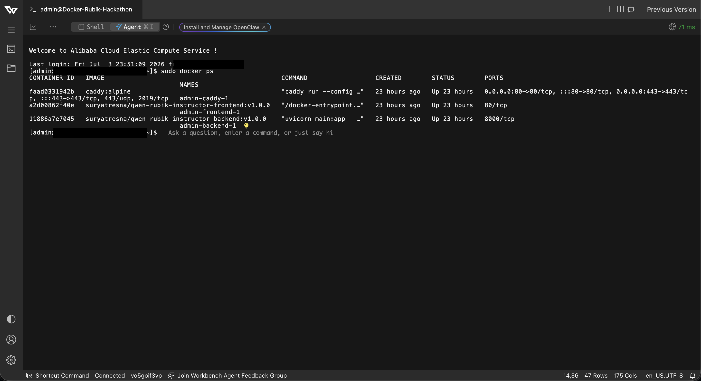
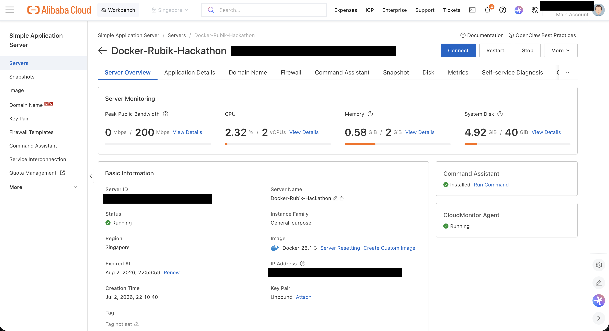
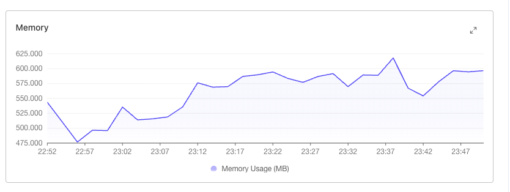

# One box, three containers: deploying the stack to Alibaba Cloud

*Part 15 of a series on turning a Rubik's cube prototype into a learn-with-LLM tutor.*

## The requirement

Everything in Parts 1–14 ran on a laptop: `uvicorn` on port 8000, Vite on
5173, and a `.env` file gluing them together. That was fine for building, but
the Qwen Cloud Hackathon submission has an infrastructure requirement the
laptop can't satisfy: the stack has to *run on Alibaba Cloud*, demonstrably.
Until this week, the only Alibaba service in the picture was the DashScope
API call that reaches Qwen — the README's own roadmap admitted as much
("Today the only Alibaba usage is the DashScope call to Qwen").

So the assignment: take a FastAPI backend and a static SvelteKit frontend and
put them on Alibaba infrastructure, with HTTPS, a real domain, and a deploy
path that doesn't involve `scp`-ing files at midnight. The result is live at
[rubik.suryatresna.asia](https://rubik.suryatresna.asia/).

The shape we landed on is deliberately boring: **one small VPS, three
containers, one compose file**. No Kubernetes, no serverless, no managed
anything beyond the VM itself. For a two-service app with a deterministic
fallback mode, boring is a feature.

## Containerizing: two multi-stage builds

Both images are multi-stage, and both stages exist for the same reason:
the thing you need to *build* the app is much heavier than the thing you
need to *run* it.

The backend builds a virtualenv in a throwaway stage and copies only the
venv into the runtime image:

```dockerfile
FROM python:3.12-slim AS build
RUN apt-get update && apt-get install -y --no-install-recommends build-essential cmake && rm -rf /var/lib/apt/lists/*
RUN python -m venv /app/venv
COPY requirements.txt .
RUN /app/venv/bin/pip install --no-cache-dir -r requirements.txt

FROM python:3.12-slim AS runner
COPY --from=build /app/venv /app/venv
ENV PATH="/app/venv/bin:$PATH"
CMD ["uvicorn", "main:app", "--host", "0.0.0.0", "--port", "8000"]
```

The `build-essential cmake` line is insurance for native dependencies —
`libsql` (Part 13's persistence layer) ships a native core, and when pip
can't find a matching wheel it compiles from source. The runtime stage never
sees a compiler.

The frontend is the classic node-to-nginx handoff. SvelteKit's static
adapter emits plain files, so the runtime image is just `nginx:alpine`
serving a directory, with a one-server config whose only job is the SPA
fallback (`try_files $uri $uri.html $uri/ /index.html;` — the `$uri.html`
clause is what serves the prerendered pages).

One line in that Dockerfile matters more than it looks:

```dockerfile
ARG PUBLIC_BACKEND_URL
ENV PUBLIC_BACKEND_URL=$PUBLIC_BACKEND_URL
RUN npm run build
```

`$env/static/public` values are inlined at build time (Part 8 hit this the
hard way when the variable was merely *missing*). The deployment consequence
is worth stating plainly: **the frontend image is domain-specific**. The API
origin is baked into the JavaScript bundle, so you can't point one frontend
image at a different backend by flipping an env var at runtime — you rebuild.
For a single-environment hackathon deployment that's an acceptable trade; for
anything multi-environment it's the first thing to redesign.

## One box, three containers

The compose file wires three services, and only one of them can be reached
from the internet:

```yaml
services:
  caddy:      # ports 80:80, 443:443 — the only published ports
  backend:    # uvicorn on 8000, internal network only
  frontend:   # nginx on 80, internal network only
```

Caddy is the whole edge story. It terminates TLS with certificates it
provisions itself from Let's Encrypt — no certbot, no cron, no openssl
incantations — and persists them in a named volume (`caddy_data`) so
restarts don't re-issue. The entire reverse-proxy config is seven lines,
and it doesn't even live in a separate file: compose's `configs:` block
inlines it at the top of `docker-compose.yml`:

```yaml
configs:
  caddyfile:
    content: |
      ${DOMAIN} {
          reverse_proxy frontend:80
      }

      api${DOMAIN} {
          reverse_proxy backend:8000
      }
```

Look closely at `api${DOMAIN}`. There's no dot. With
`DOMAIN=rubik.suryatresna.asia` in the server's `.env`, the API host is
`apirubik.suryatresna.asia` — `api` glued directly onto the front of the
domain, not an `api.` subdomain of it. This started as a typo-shaped
accident and shipped as a working decision: both names are just DNS records
pointing at the same box, Caddy happily gets a certificate for each, and
the frontend build arg (`PUBLIC_BACKEND_URL: https://api${DOMAIN}`) uses
the *same* interpolation, so the two sides agree by construction. You can
verify it from the outside — `rubik.suryatresna.asia` and
`apirubik.suryatresna.asia` resolve to the same VPS.

The repo also carries a root-level `Caddyfile` that says `api.{$DOMAIN}` —
*with* the dot. It's dead config: compose's inline version is what actually
mounts into the container, and the two disagree. Nobody noticed, because
nothing reads the file. That's the quiet cost of inlining config — the
standalone file kept existing, kept looking authoritative, and drifted.

Two more compose details earn their lines. `CORS_ORIGINS:
'["https://${DOMAIN}"]'` pins the backend's CORS allowlist to exactly the
one origin that should be calling it. And the backend mounts a `db_data`
volume at `/app/data` — that's Part 13's kill-switch persistence: point
`TURSO_DATABASE_URL` at a file path and the libSQL database lives on the
volume; leave it empty and the backend runs stateless, on the same image.

## Tag-to-deploy

Deployment is a GitHub Actions workflow with two jobs, triggered by nothing
but a version tag:

```
git tag v1.0.0 && git push --tags
```

The first job builds both images with buildx for `linux/amd64` — the dev
machines are Apple Silicon, the VPS is x86, so the platform flag isn't
optional — and pushes them to Docker Hub as
`suryatresna/qwen-rubik-instructor-{backend,frontend}`, tagged both with the
version and `latest`. The frontend build gets `PUBLIC_BACKEND_URL` from a
repository secret, because of the bake-at-build-time rule above.

The second job is the entire "deployment platform": an SSH action that logs
into the VPS and runs

```
cd /opt/qwen-rubik-instructor
docker compose pull
docker compose up -d --remove-orphans
```

That's it. No agents on the box, no registry webhooks, no blue/green. The
server keeps a checked-out compose file and a `.env` with four values —
`DOMAIN`, `DASHSCOPE_API_KEY`, and the optional Turso pair — and every
deploy is "pull newer images, recreate what changed."

## The box itself

The VPS is an Alibaba Cloud **Simple Application Server** in Singapore:
2 vCPU, 2 GiB RAM, a 40 GiB ESSD, created from Alibaba's prebuilt **Docker
26.1.3** image — so the machine came out of the box already speaking
compose, and setup was `.env` + `docker compose up`.



Simple Application Server is the fixed-price, batteries-included tier below
ECS — you trade away VPC plumbing and instance-type menus for a flat monthly
cost and a console that already has monitoring, snapshots, and a firewall
tab. For one box running three containers, everything ECS would have added
was surface area we'd never touch. (Function Compute was the other
candidate, and it fell to a different knife: Part 9's narration streams over
SSE, and long-lived streaming responses are exactly what request-scoped
serverless makes awkward.)

`docker ps` on the box shows the whole production topology in three lines —
Caddy holding 80/443, and the two `v1.0.0` app images from Docker Hub with
no published ports at all:



And the monitoring tab answers the capacity question — the full stack idles
around 0.58 GiB of the 2 GiB and a few percent CPU:



Memory over an evening of use stays in a 475–625 MB band:



That headroom isn't luck; it's the architecture the whole series has been
building. The heavy lifting — narration, reasoning, the LLM — happens on
DashScope's side of the API call. The box only runs a solver, a state
machine, and a reverse proxy. Which also means the submission's Alibaba
story is now two services deep: **DashScope** does the thinking,
**Simple Application Server** does the serving.

## What this deploy honestly doesn't do yet

Being honest about the gaps, in the tradition of every part before this one:

- **Challenge Me isn't live yet.** The `v1.0.0` images were built and
  deployed on July 2–3; Part 14's Google auth landed July 4. The backend
  now reads `GOOGLE_CLIENT_ID`, `GOOGLE_CLIENT_SECRET`, and `FRONTEND_URL`,
  and the compose file passes none of them. Shipping it needs a new tag
  *and* three new lines in the compose `environment:` block.
- **The compose file has forked from the server.** The repo's copy has
  `build:` contexts active and the registry `image:` lines commented out —
  right for local development, but the VPS runs the pushed images. The same
  file is trying to be both the dev harness and the production manifest,
  and it's currently better at the first job.
- **The dead `Caddyfile`** at the repo root should either be deleted or
  become the mounted config again. Config that nothing reads is worse than
  no config.
- **Deploys track `:latest`.** The SSH job pulls whatever `latest` points
  at, so rollback is "push an older tag as latest again" rather than
  "change a pinned version." Pinning the compose file to explicit versions
  would make deploys reproducible and rollbacks a one-line diff.
- **It's one box.** No replica, no health-checked restart beyond
  `restart: unless-stopped`, and a Let's Encrypt cert volume as the only
  state that would hurt to lose. For a hackathon demo that's the right
  amount of infrastructure; it just shouldn't be mistaken for more.

The through-line from the rest of the series holds here too: the
deterministic skeleton travels well. The same emergent-fallback design that
let Part 12 run E2E without an API bill and Part 13 run without a database
is what makes this deployment small — a box that only ever does bounded,
deterministic work, with the generative parts safely on the other side of
an API key.
