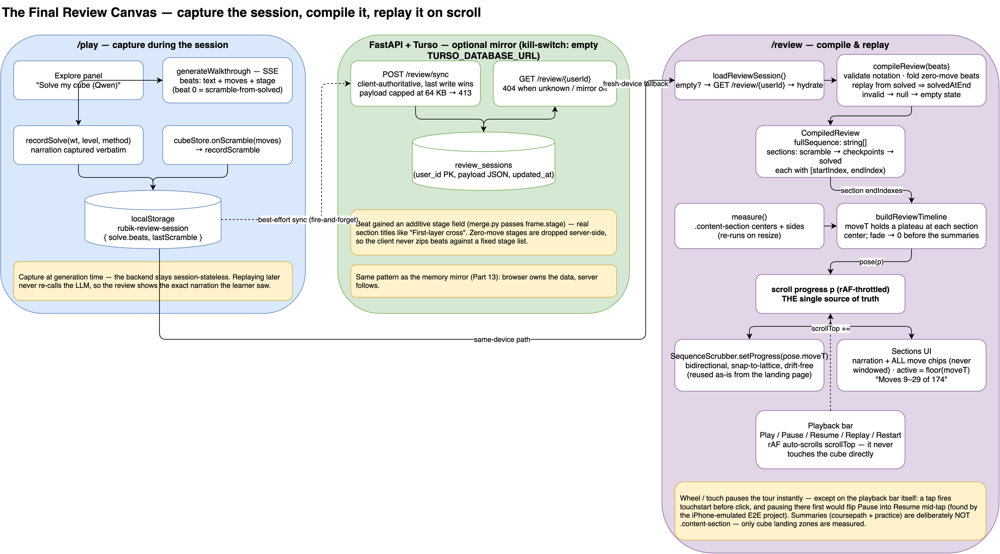
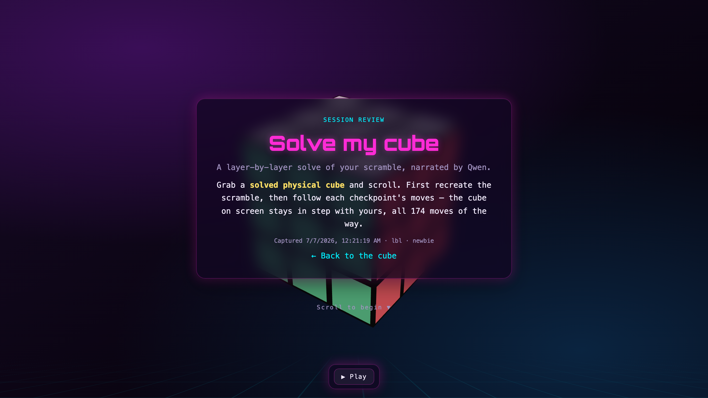
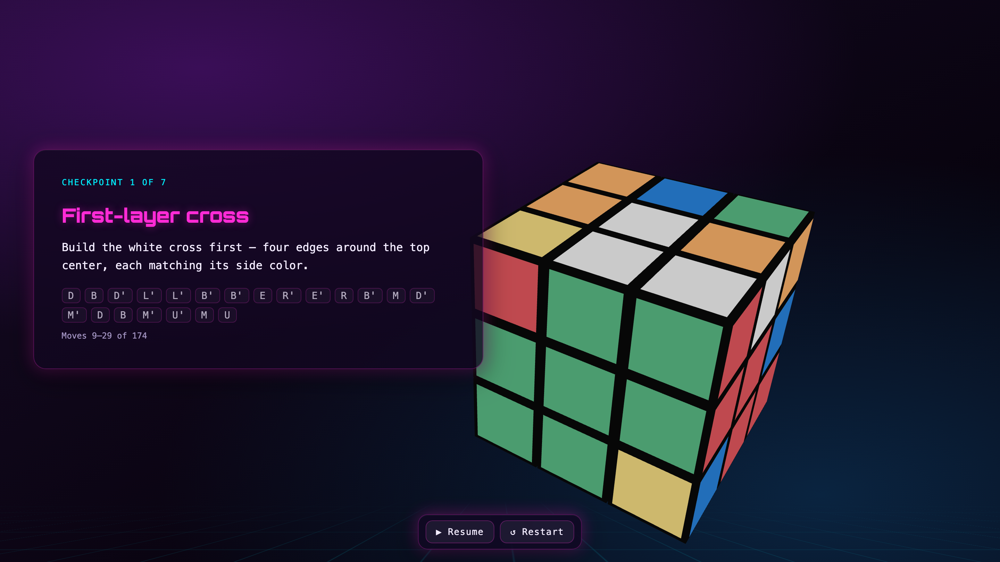
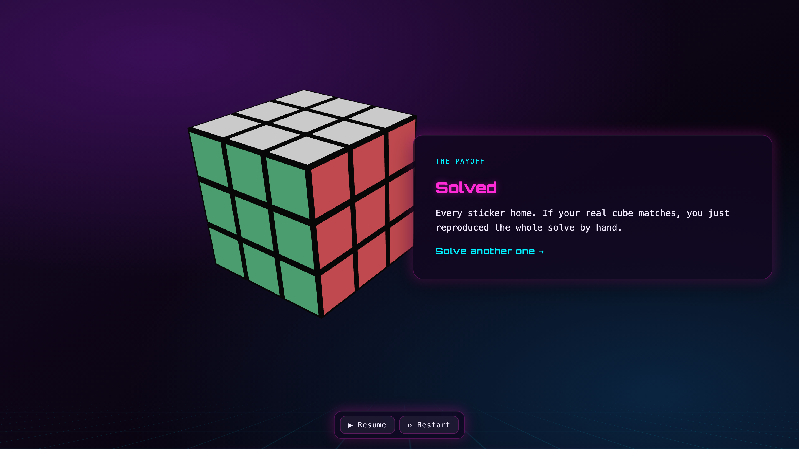
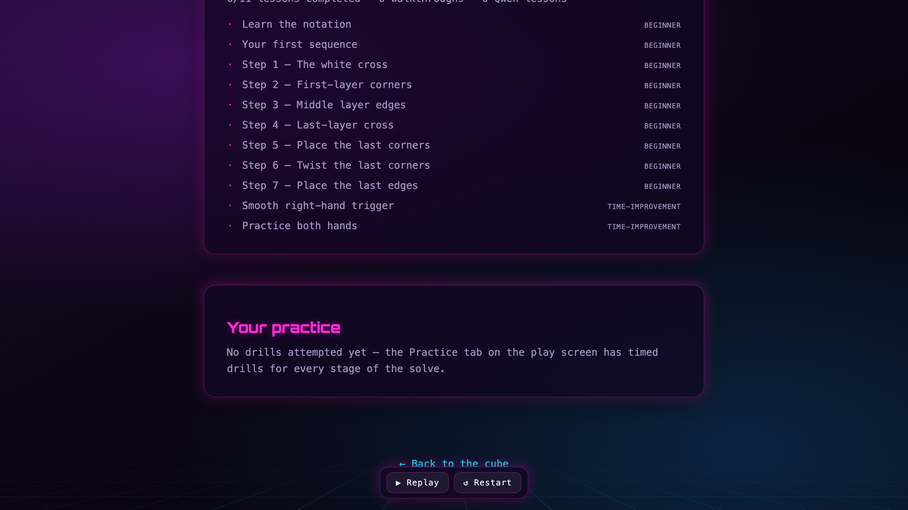
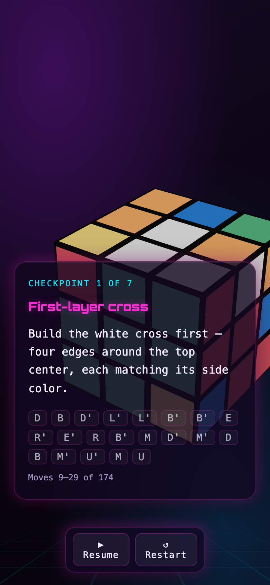

# The final review canvas: replay your solve on a real cube

*Part 17 of the engineering log. Parts [13](./13-memory-that-outlives-the-browser-turso-with-a-kill-switch.md)
and [14](./14-challenge-me-google-auth-and-a-leaderboard-with-a-clock.md) built
the memory mirror and the landing page's scroll choreography; this part spends
both.*

Everything the app teaches evaporates when the session ends. Qwen plans a
solve for your exact scramble, narrates it beat by beat, the reference cube
demonstrates, your cube ends solved — and then it's gone. The narration lived
in a store that dies with the tab; the backend, by design, never kept any of
it. A learner who wanted to *redo* their solve on the physical cube sitting on
their desk had nothing to go back to.

The ask: one scrollable canvas that compiles the whole session — the
coursepath, the Qwen solve, its narration, the practice history — from the
scramble, checkpoint by checkpoint, to solved. And it had to be **reproducible
on a real cube**: start from a solved cube in your hands, follow the page, and
end with the same solve the app performed.


## The data was already flowing past us

The tempting design was a new backend feature: persist solves, add a replay
endpoint, maybe re-narrate on demand. All of it wrong, for a reason Part 13
already taught us: **the browser owns the session**. And on closer inspection,
everything the replay needs was already streaming through the client at
generation time:

- A "Solve my cube" walkthrough arrives as SSE beats, and **beat 0 is the
  scramble** — the planner sets it to `invert(solution)`, the exact moves that
  take a *solved* cube to the learner's scrambled state. That's the
  reproducibility contract, sitting in the payload all along.
- Beats 1..N are one solver stage each: the moves, the highlight, and the
  narration text Qwen wrote *for this solve*.

Re-generating any of this later can't work — narration runs at temperature
0.7, so the words are never the same twice. The only way to show the learner
*their* session is to capture it as it happens. So the feature starts with a
seam, not a feature: `recordSolve()` in the Explore panel, exactly where
`appendHistory` already ran, writing the walkthrough — narration included —
to a `rubik-review-session` key in localStorage. A second hook widens
`cubeStore.onScramble` to pass the generated move list (it fired with no
arguments before; the challenge store's anti-cheat subscriber never needed to
know *what* was scrambled, but the review does).

The backend stays session-stateless. One additive change: the wire `Beat`
gained a `stage` field (three lines in `schema.py` and `merge.py`), so review
sections can be titled "First-layer cross" instead of "Checkpoint 1". A detail
that matters: the planner **drops zero-move stages server-side**, so the
client must never zip beats positionally against the fixed stage list — the
stage id has to ride on the beat itself.

## A mirror, because memory already had one

localStorage-only capture has the same flaw the learner profile had in Part
13: clear your storage or switch devices and the review is gone. The fix is
the same pattern, reused verbatim: a **client-authoritative, best-effort Turso
mirror** behind the existing kill switch. Migration `0005` adds one table —
`review_sessions(user_id PK, payload JSON, updated_at)` — and two endpoints:

- `POST /review/sync` — replaces the payload wholesale, last write wins,
  returns `persisted: false` with a 200 when the DB is off (fire-and-forget
  clients never see an error), and rejects anything over 64 KB with a 413
  (a real captured solve is a few KB; anything near the cap is malformed).
- `GET /review/{userId}` — the fresh-device fallback: `/review` finds
  localStorage empty, asks the mirror, hydrates, and proceeds as if the
  capture had always been local.



## Compile as the trust boundary

Between the captured beats and the canvas sits one pure function, and it's
the load-bearing one:

```ts
compileReview(beats: Beat[]): CompiledReview | null
```

It validates every move against the live cube's alphabet, folds zero-move
narration beats into the next checkpoint, lays the sections out as contiguous
`[startIndex, endIndex)` ranges over one flat `fullSequence` — and then does
the thing this codebase always does: **replays the entire sequence through
the cube model from solved and checks `isSolved` at the end**. A capture that
doesn't provably land solved compiles to `null`, and the page shows its empty
state. The scrubber never renders from unvalidated data; there is no way to
ship a review that lies about solving the cube.

The unit-test fixture writes itself: the landing page's captured 174-move
solve, split by the stage lengths documented in `solve-sequence.ts`, is a
real solver output with known-good structure — assert the compiled
`fullSequence` matches, the ranges tile perfectly, and `solvedAtEnd` is true.



## The canvas: the landing page grows a second life

The landing page already solved "a cube that performs while you scroll":
a single fixed WebGL canvas behind the content, sections measured as landing
zones, and a `SequenceScrubber` that bakes whole moves analytically and shows
the current one mid-turn — bidirectional and drift-free over thousands of
scroll writes. All of that is reused as-is. Two pieces are new:

- **A simpler timeline.** The landing timeline is tuned to its hero
  choreography (explode, settle-spin, split view). The review wants something
  calmer: `moveT` ramps between sections and **holds a plateau around each
  section's center**, so the cube sits settled at every checkpoint while you
  read and mirror the moves on your real cube. Pure math, unit-tested for
  monotonicity and exact holds, sharing the landing's `smoothstep`/`interp`.
- **Full notation, never windowed.** The play screen's move bar windows long
  sequences to ten chips around the active move — right for watching, wrong
  for reproducing. The review renders **every move of every section** as
  chips, with the active one lit as the cube passes it and a running "Moves
  9–29 of 174" counter. If you're holding a real cube, a hidden move is a
  broken promise.



Part 14's hard-won rule applied immediately: only `.content-section` elements
are landing zones — `measure()` sees nothing else. The coursepath and
practice summaries at the bottom (lesson completion from `rubik-lesson:*`,
best times from `rubik-best:*`, attempt stats from the profile — read live,
duplicated nowhere) are deliberately *not* `.content-section`, or the cube
would park on top of them.




## Playback: the tour should also run hands-free

A scroll-only replay is half an experience — it only moves when you do.
Feedback said it plainly: if it's one way, it won't be good. So the canvas
grew a floating control bar: **Play** runs the tour, flipping contextually to
**Pause**, **Resume**, **Replay** at the end, plus **Restart**.


The implementation is one decision followed to its conclusion: **scroll stays
the single source of truth**. Play doesn't drive the cube, doesn't touch the
scrubber, doesn't own any state the page didn't already have — it just
advances `scrollTop` inside a `requestAnimationFrame` loop (~6 seconds per
checkpoint). The scrub, the chip highlights, and the section reveals all
derive from scroll exactly as before, so hands-free and hands-on can never
disagree. Grabbing the wheel or touching the page pauses the tour instantly
and hands control back.

That last listener hid the best bug of the feature. On desktop everything
worked; the iPhone-emulated E2E project failed with the page mysteriously
still scrolling after tapping Pause. The trace: on a touch device a tap fires
`touchstart` *before* its `click` — so touching the Pause button paused the
tour via the take-over listener, the button re-rendered as **Resume**, and
the tap's click landed on Resume. **Tapping Pause un-paused itself.** On a
real phone, stopping the tour would have been impossible. The fix is one
guard — events originating inside the playback bar are exempt from the
take-over — and the reason it was ever caught is that the suite runs a real
phone emulation project, not a resized desktop viewport.



Reduced motion is respected end to end: the canvas parks a solved, still
cube, the playback bar doesn't render, and the narration plus full notation
still carry the entire real-cube reproduction on their own.

## The detour: nine failures that weren't ours

Mid-feature, the full E2E suite showed nine failures. Before touching
anything we ran the same specs on a clean checkout — **byte-identical failure
sets** with and without the feature branch. Pre-existing, then. But
"pre-existing" isn't a root cause, and the follow-up investigation found
something worth writing down: all nine were **stale selectors from the guide
revamp (PR #29)**. That PR moved the lesson runner out of the Lessons panel
and into the stage caption — deleting the panel's `.lsn-counter` detail view
the specs drove — and rebuilt the touch keypad with new class names. The app
was never broken; five spec files were testing a UI that no longer existed.

Rewriting them against the current surface (`.stage-counter`,
`.stage-btn`, `.keypad-bar .key-row`) turned the suite green — including two
tests that had silently rotted since the revamp shipped. The lesson for the
log: **after a UI revamp, grep the E2E specs for the selectors you deleted.**
A spec that fails locally but "was already failing" is a debt with a
root cause, not an environment quirk. (Same sweep caught a backend test
frozen in time: the migrations assertion still expected exactly versions
`[1, 2]` while migrations 3 and 4 shipped around it.)

## Where it landed

- **Capture**: `recordSolve`/`recordScramble` → `rubik-review-session`,
  mirrored best-effort to Turso `review_sessions` (client wins, kill-switch
  guarded, 64 KB cap).
- **Compile**: validated, solved-checked `CompiledReview` or an honest empty
  state — never a broken scrub.
- **Canvas**: landing-page architecture reused (fixed canvas, measured
  sections, `SequenceScrubber` untouched), new plateau timeline, full-notation
  chips, coursepath + practice summaries.
- **Playback**: play/pause/resume/replay as pure auto-scroll; touch-exempt
  pause; reduced-motion fallback.
- **Suite**: 747 backend tests, 260 frontend unit tests, 29 E2E specs
  (desktop + iPhone emulation) — all green, including the nine that predated
  the feature.

The through-line holds one more time: deterministic skeleton, generative
skin. Qwen's words are captured, not regenerated; the moves under them are
validated, replayed, and proven solved before a single pixel scrolls. The
canvas can promise "follow this on a real cube and it will end solved"
because the compile step refuses to render anything it can't prove.
