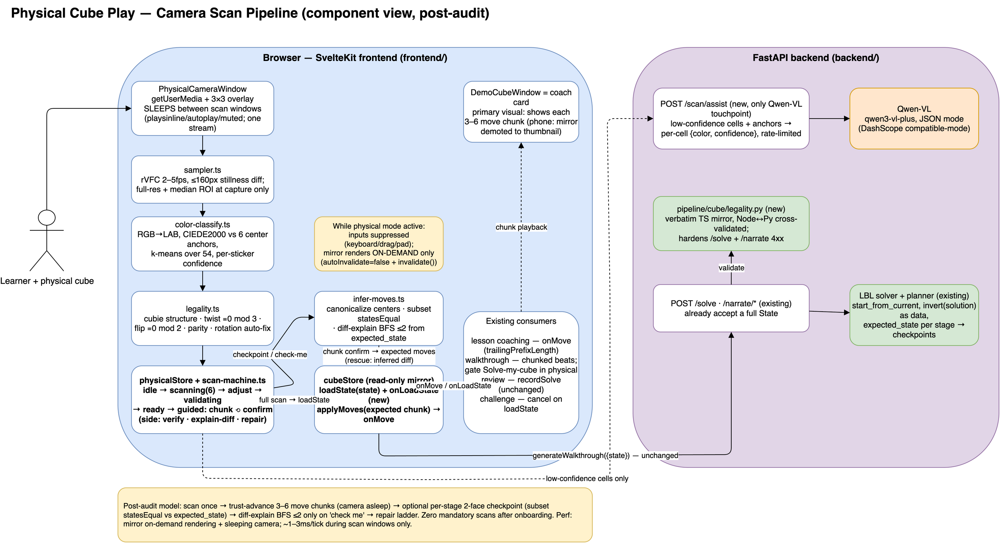
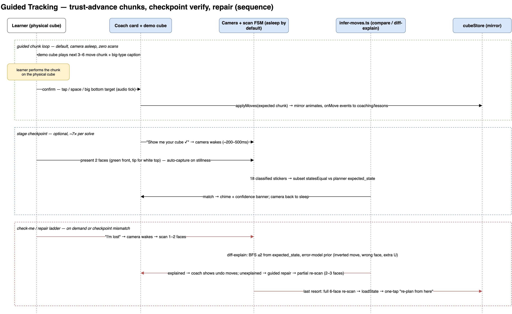

# The cube in your hands: camera scanning without a vision bill

*Part 18 of the engineering log. Part [17](./17-the-final-review-canvas-replay-your-solve-on-a-real-cube.md)
made a solve replayable on a real cube; this part closes the loop from the
other side — the real cube comes* into *the app. The full research and
feasibility trail lives in
[`research/physical-cube-camera-play.md`](./research/physical-cube-camera-play.md).*

Everything the app does starts from a digital scramble. But every learner who
tried it owns an actual cube, sitting scrambled on their desk, and the honest
question was always: *can it solve mine?* The feature ask: scan a physical
cube with a webcam or phone camera, load it into the app, and have Qwen walk
you through solving the one in your hands — with the app checking your real
cube along the way.

The obvious design uses a vision model for everything: photograph each side,
ask Qwen-VL for the colors, track every turn on camera. We built almost none
of that, and the feature is better for it. This part is about the three
decisions that made it work: killing live move-tracking *before* writing it,
building the vision pipeline against image fixtures before any camera code
existed, and scoping the vision LLM down to the one job it's actually good
for.

## The feature we didn't build

The first draft of the design had the camera watching continuously: after
every turn of the physical cube you'd show it to the camera, the app would
diff the state and infer which move you made. A feasibility pass killed it
twice over, with arithmetic rather than opinion.

**Cadence.** Our layer-by-layer solver produces 80–120 quarter-turns. A scan
gesture is not free — stop turning, reorient to the protocol grip, hold
steady for a second, wait for the classifier, maybe re-present. At 5–10
seconds each, that's **5–13 minutes of pure scan overhead** injected into a
beginner's 15–40 minute solve, as 40–80 flow interruptions. Nobody finishes
that session.

**Observability.** A single face shows 9 of 54 stickers. Turn the back face
and the front face doesn't change *at all* — roughly one move in six is
invisible to whatever side you're showing the camera. And a breadth-first
search over 2–3 moves has hundreds of candidate sequences that collide on
just 9 observed stickers. Inference is reliable exactly when the learner is
on-script — which is when nobody needs it.

The literature agreed: the best published cube move-detection pipeline
(YOLOv8 + ConvLSTM ensembles) reaches ~94% accuracy on **three** of the
eighteen move types. Live move decoding from video is an open problem, and we
were not going to solve it as a side quest.

The fix inverts the trust model, using something the backend already had:
the planner computes the exact expected cube state after every solver stage.
So:

> **Scan once. Trust by default. Verify at checkpoints. Infer only to explain
> mistakes.**

The learner performs the walkthrough in 3–6 move chunks and just *confirms*
each one — the on-screen cube advances by the expected moves, and the camera
stays asleep. At stage boundaries (or whenever they tap "Check my cube") the
camera wakes for a few seconds: show it any two sides, and each is compared
against the predicted state with a plain `statesEqual` on the visible subset.
No inference, no depth problem — you can't misidentify a deviation you're
only *confirming the absence of*. Inference survives in exactly one place:
when a check fails, a bounded search (depth ≤ 2 over the 18 face and slice
turns) tries to *explain* the deviation from the predicted state, ranked by a
beginner error model — did the next move backwards, right face wrong
direction, stray U fidget — and answers with the undo sequence. Beyond depth
2, a repair ladder takes over, ending in "re-scan and re-plan from wherever
you actually are."

Zero mandatory scans after onboarding. The hardest CV problem in the original
design (decode arbitrary moves from partial observations) became the easiest
one (equality against a known state).

## Fixtures before camera

The scanning pipeline itself is classical CV, and it was fully built and
tested before a single line of `getUserMedia` code existed. Every stage is a
pure function over a plain `{width, height, data}` RGBA buffer — the same
shape as a browser `ImageData` and as a PNG decoded in node — so the whole
scanner runs in Vitest with no browser at all:

1. **Sample**: each of the 9 grid cells reduces to the *median* of an inner
   region — glare on glossy stickers and edge bleed from black plastic
   disappear into the tails of the distribution.
2. **Classify**: convert to LAB and compare with CIEDE2000 — but never
   against absolute color thresholds. The six *center* stickers captured
   during the scan ARE the calibration: every sticker is matched to its
   nearest center anchor, refined by a short k-means over all 54 samples.
   Classifying *relatively* is what survives auto-white-balance drift between
   faces — and on iOS Safari it isn't a nicety, because `exposureMode` and
   `whiteBalanceMode` camera constraints simply aren't available to lock.
3. **Tie-break** the two pairs that actually confuse cameras — red/orange by
   hue angle, white/yellow by b\* — only when the top two candidates are
   nearly tied, and report a per-sticker confidence either way.

The test corpus is 72 synthetic face renders — three scrambles under
normal light, a warm white-balance cast, dim light, and specular glare, with
exact ground truth for free because we generated them — plus real webcam
photos from the internet (face crops from the MIT-licensed
[qbr](https://github.com/kkoomen/qbr) project, hand-labeled). The accuracy
gates run in CI: ≥52/54 stickers on normal light, ≥48/54 under stress with
the misreads *flagged as low-confidence* — a wrong-but-flagged sticker costs
the user one tap in the review grid; a confidently-wrong one costs them a
broken scan. The real photos passed on the first run, overlay graphics,
glare band and all, which is the median sampler earning its keep.

## The 1-in-12 problem

Color counting is not validation. A state with exactly nine stickers of each
color is physically solvable with probability **1/12** — one flipped edge or
twisted corner sails through and dies later, deep in the solver, as an opaque
HTTP 422. Scan errors produce exactly these states, routinely.

So the validator does the group theory: every corner must be one of the 8
legal color triples *read clockwise* (a mirrored reading is an impossible
sticker peel), every edge one of the 12 legal pairs, each exactly once;
corner twists must sum to 0 mod 3; edge flips to 0 mod 2; and the corner and
edge permutation parities must agree. The structural check is the star,
because it points at the *specific cubie* that can't exist — the UI
highlights the two suspect stickers and says "these look swapped, tap the
wrong one," never the word "parity."

Two details earned their complexity. First, slice moves displace *centers*,
so every comparison canonicalizes the cube's orientation first (find the
whole-cube rotation that puts centers home) — which also makes the learner
reorienting their physical cube between scans invisible, exactly as it
should be. Second, the scan protocol anchors each face's *identity* by its
center but can't know its *rotation*, so on a failed validation the app
silently retries each face's reading at 0/90/180/270°. Property tests
surfaced a genuine surprise there: a scrambled cube can have a face whose
180°-rotated reading is *coincidentally also legal*. The fix is Occam's
razor — accept the fix that rotates the fewest faces, and treat ties as
genuinely ambiguous.

The whole validator is ~150 lines of TypeScript, mirrored line-for-line into
Python and pinned by a frozen fixture of 53 states both engines must agree
on — the same cross-validation convention the move engine has used since
Part 10. The Python side now guards `/solve` and `/narrate` for every caller:
"impossible cube state: one edge appears flipped — check the U, F sides"
instead of a stack trace.

## One new verb on the cube store

Integration was the part the research doc sweated most, and it collapsed into
almost nothing, because everything downstream of the cube already consumed
two primitives: a facelet state and a stream of completed-move events. The
physical feature is just two new *producers* of those primitives.

`cubeStore.loadState(state)` is the first — the live cube had no way to
accept an arbitrary state (it only ever mutated by animated moves), but the
reference cube had been doing rebuild-and-repaint since Part 10, so the seam
was three lines plus one subtlety: the rebuild call silently no-ops while a
move is animating, so the animator learns `cancel()` first. Chunk
confirmations are the second producer: applying the expected moves fires the
same per-move events as keyboard input, so lesson coaching, review capture
(Part 17), and the challenge clock all work in physical mode *unchanged*.

One integration was load-bearing enough to ship in the same commit as
`loadState` itself: the challenge leaderboard's anti-cheat cancels a run on
any reset or scramble it didn't initiate — and a scanned-in state is a new
way to cheat (scan a solved cube mid-run; the solved-detector can't tell).
`onLoadState` joins `onReset` and `onScramble` in the cancel list, one line,
verified by an end-to-end test.

The camera itself follows a strict lifecycle contract, because the
feasibility audit found the app's cube was *already* rendering every frame
(an auto-invalidating render task was defeating Threlte's on-demand mode) and
a live camera on top of that is how phones cook. During a physical session
the mirror renders only when something actually moves, and the camera track
is **stopped entirely** between scan windows — LED off, zero recurring cost,
and one long-lived stream per window because a second `getUserMedia` mutes
the first on WebKit. The recurring cost of "the app is watching" is a
frame-diff on a 160-pixel canvas a few times a second, ~1–3 ms per tick,
only while a scan window is open — that's the stillness detector that makes
captures automatic (your hands are holding a cube; nobody can click).

## Qwen-VL, scoped to what it's good at

The research question that started all this was "use Qwen-VL to map the
sides." The numbers said otherwise: a full six-face scan costs well under a
cent (images tokenize at roughly a token per 28×28px patch), but each image
is a 1–4 second round trip, and there is **no published benchmark anywhere**
for VLM cube-sticker extraction — color under uncontrolled lighting is a
known VLM weak spot, and one hallucinated cell makes the state unsolvable.
Purpose-built classical scanners report ~99%. That's the bar, and an
unbenchmarked model doesn't get to be the source of truth for a state where
a single wrong sticker is fatal.

So Qwen-VL got the job it's actually suited for: a second opinion.
`POST /scan/assist` is the backend's only vision touchpoint — the scan store
keeps a small JPEG crop of each captured face, and when the review grid has
low-confidence or suspect stickers, "Ask Qwen to double-check" sends *those
faces* with the doubtful cell indices. The endpoint reuses the DashScope
client from Part 2 with a vision model and JSON mode, enforces a per-image
size cap (the 413 idiom from Part 13) and a token-bucket rate limit, and
degrades exactly like narration does — on any failure the client gets
`{faces: [], degraded: true}` and the human fixes the stickers by hand. The
suggestions land in the grid as edits, still user-confirmable; the legality
validator remains the last word.

## The bug that froze the UI (and the store didn't notice)

The war story of this part. End-to-end tests drove the whole scan through a
fake camera and kept failing at the same spot: the store said the scan was
done and the review grid should be showing, but the DOM still showed the
camera view, frozen at "face 6 of 6." Store and UI, same object, two
realities.

A probe that read both in the same breath cracked it: `storePhase: 'adjust',
hasGrid: false`. The sticker-grid component rendered the cube net with a
keyed `{#each}` whose key for the *gap* cells was computed with `indexOf` —
three gaps in a row, three identical keys. Svelte 5 doesn't warn about
duplicate keys; it **throws at runtime**, mid-update, which aborts the entire
DOM patch. The stores kept advancing; the screen kept showing the last
successfully rendered frame. Every symptom — reactive store, frozen UI, no
error in sight until you look at the page console — follows from that one
property. Positional keys, one-line fix, and a lesson filed permanently:
*a Svelte each-key collision doesn't degrade, it detonates.*

## Recording the demo with someone else's hands

The GIFs in this part are real recordings of the real app — but the "camera"
is the same fake the e2e suite uses: `getUserMedia` stubbed with a canvas
`captureStream`. For the suite, the canvas holds flat painted faces. For the
GIFs, it holds actual internet webcam footage — a frame from qbr's demo (a
hand holding a cube up to a laptop camera, MIT-licensed), zoomed so the
cube's face fills the sampling grid, with the protocol face's sticker colors
composited over the real stickers. The result runs the entire genuine
pipeline — stillness detection, median sampling, anchored classification,
legality, `loadState` — against footage with a human hand in it.

Two harness details worth stealing: a canvas `captureStream` only emits
frames when the canvas *changes*, so a sub-threshold corner pixel toggles
every 120ms to keep the video alive while reading as "still"; and a capture
can land on a torn mid-repaint frame and get rejected, after which a static
canvas would never re-arm the stillness trigger — so the harness re-paints
(motion) and retries, which is exactly what a human does with a cube.

## Where it landed

Four commits, one per milestone: the fixture corpus and pure pipeline; the
scan MVP with `loadState` and read-along walkthroughs; guided tracking with
chunks, checkpoints, diff-explain and the repair ladder; and the Qwen-VL
assist plus the Python legality mirror. 817 backend tests, 369 frontend unit
tests (including the classifier accuracy gates), and 32 end-to-end tests —
five of which scan, verify, deviate, and recover through the fake camera.

The architecture, drawn (sources in [`diagrams/`](./diagrams/)):

Still deliberately unbuilt, tracked in the research doc as the next tier: a
*ranked* physical challenge (unanswerable until the server issues the
scramble and verifies the first scan — today a physical session simply
cancels any live run), ML grid localization if the fixed overlay proves
finicky on real phones, and per-chunk timestamps in the review canvas. And
one number we can't get from a fake camera: how the classifier does against
*your* cube, under *your* desk lamp — the fixture corpus has a `real/`
directory and a README waiting for exactly those photos.
